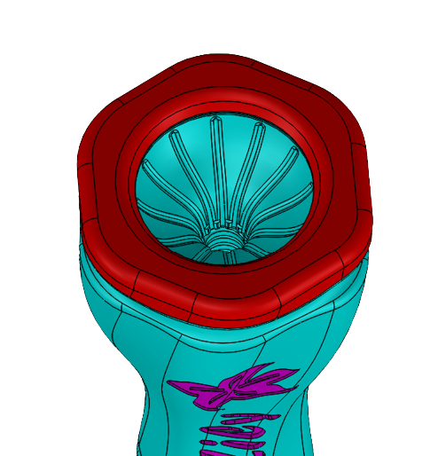
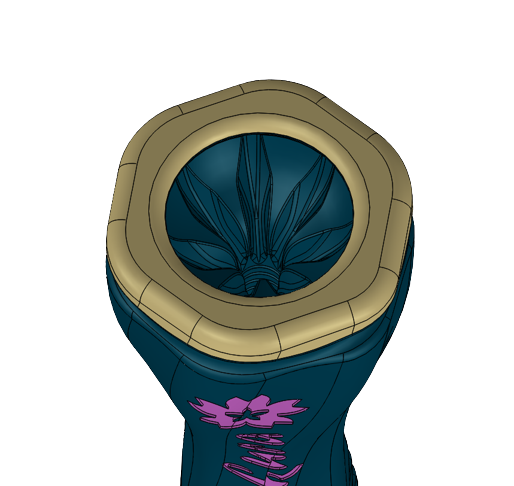
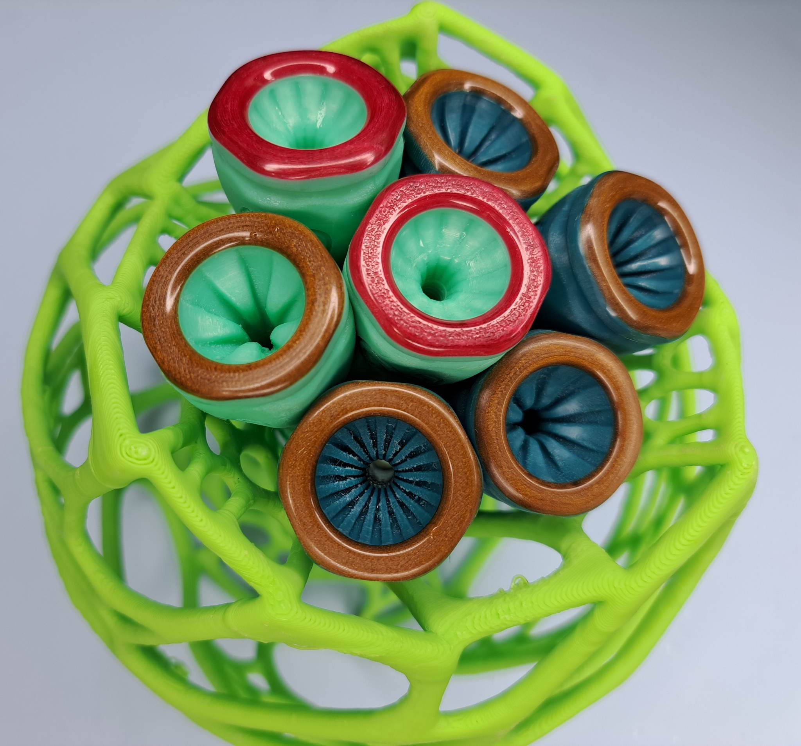
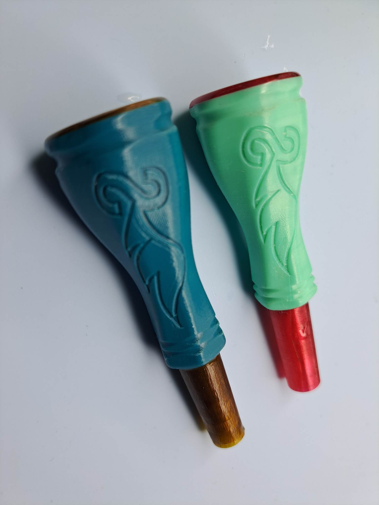

# Speed trumpet mouthpiece beta 🎺 

## Lily (Solo)
upgraded version of the CKB 7E Mouthpiece. It worked flawlessly, and the STL file at https://www.thingiverse.com/thing:291388 greatly aided me in designing it because the original is quite difficult to find. It has evolved into one of my favorite solo mouthpieces, with a clean, dazzling tone, after numerous adjustments. It provides a responsive and effortless playing experience across all registers, making it extremely free blowing.

## Sakura (Orchestra)
rich core sound great for orchestra produced by stacking 7E and 2C cups together using the new technique I invented, called finstack cup. However, there is still some sparkling bright tone present.

# Build instruction

- Print the [STL](/stl/) file. 
    - Use food-safe PETG filament.
    - Use a 0.25mm or 0.4mm nozzle with arachne mode.
    - Set the infill to 100%.
    - Set the layer height to 0.05mm - 0.1mm.
- Smooth the rim with sandpaper.

#
You like this project? You want to support me and my work, help me bring new cool stuff to the community? Well you can buy speed official product from [saxophone siam](https://saxophonesiam.com/).

Copyright (c) 2022 Tanatorn Pravalpadd under [CERN-OHL-S](/LICENSE.txt) license.
#